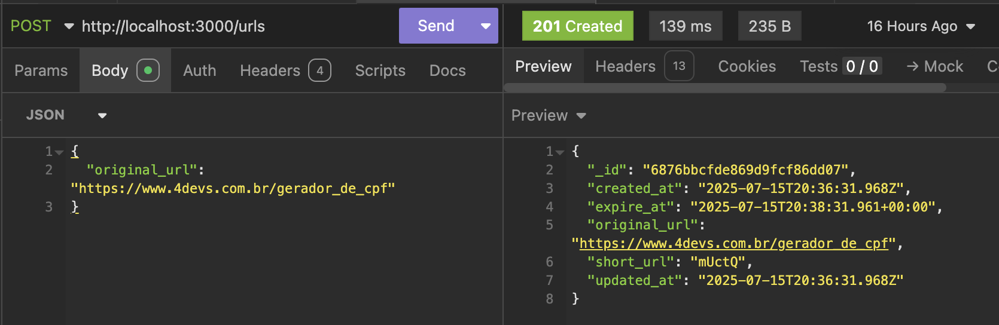
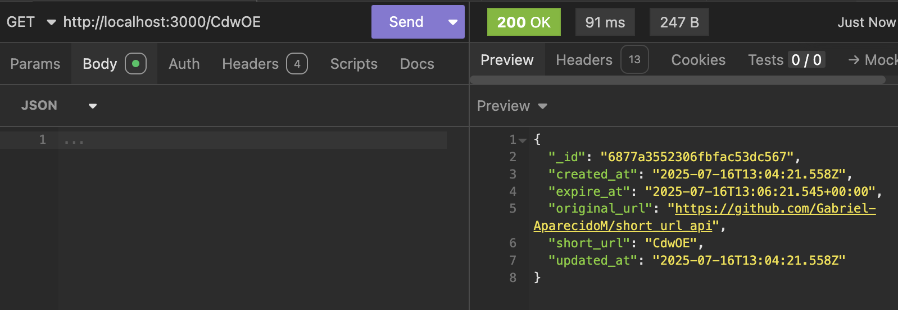
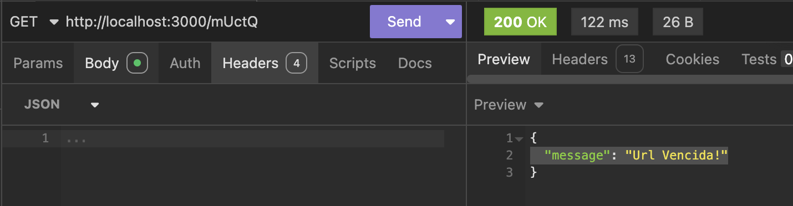

**URL Shortener API**

A simple API built with Ruby on Rails and MongoDB to shorten URLs. The main feature of this API is that the generated short URLs expire automatically after 2 minutes.

✨ Features

    Generate a unique 5-character short URL for any given original URL.

    Automatic expiration of the short URL after 2 minutes.

    RESTful endpoints for creating and retrieving URLs.

🛠️ Tech Stack

    Backend: Ruby on Rails

    Database: MongoDB (using the mongoid gem)

    Testing: API endpoints tested with Insomnia.

⚙️ API Endpoints

Here are the details of the available endpoints.

**1. Create a Short URL**

This endpoint receives an original URL and returns a shortened version of it, which is valid for 2 minutes.

    Method: POST

    Endpoint: /urls

    Body (JSON):
    {
	    "original_url": "https://www.4devs.com.br/gerador_de_cpf"
    }

✅ **Success Response (Status 201 Created):**
    {
        "_id": "6876bbcfde869d9fcf86dd07",
        "created_at": "2025-07-15T20:36:31.968Z",
        "expire_at": "2025-07-15T20:38:31.961+00:00",
        "original_url": "https://www.4devs.com.br/gerador_de_cpf",
        "short_url": "mUctQ",
        "updated_at": "2025-07-15T20:36:31.968Z"
    }

Insomnia Test Screenshot:

**2. Retrieve URL Details**

This endpoint retrieves the details of a short URL if it has not expired.

    Method: GET

    Endpoint: /:short_url

    Example URL: http://localhost:3000/aB1cD

✅ **Success Response (Status 200 OK)**

If the URL exists and has not expired:
{
	"_id": "6877a3552306fbfac53dc567",
	"created_at": "2025-07-16T13:04:21.558Z",
	"expire_at": "2025-07-16T13:06:21.545+00:00",
	"original_url": "https://github.com/Gabriel-AparecidoM/short_url_api",
	"short_url": "CdwOE",
	"updated_at": "2025-07-16T13:04:21.558Z"
}

❌ **Expired URL Response**

If the URL has expired (after 2 minutes):
{
    "message": "Url Vencida!"
}

Insomnia Test Screenshots:

-- **PTBR**

**API Encurtadora de URL**

Uma API simples construída com Ruby on Rails e MongoDB para encurtar URLs. A principal funcionalidade desta API é que as URLs curtas geradas expiram automaticamente após 2 minutos.
✨ Funcionalidades

    Gera uma URL curta única de 5 caracteres para qualquer URL original.

    Expiração automática da URL curta após 2 minutos.

    Endpoints RESTful para criar e recuperar as URLs.

🛠️ Tecnologias Utilizadas

    Backend: Ruby on Rails

    Banco de Dados: MongoDB (usando a gem mongoid)

    Testes: Endpoints da API testados com Insomnia.

⚙️ Endpoints da API

Aqui estão os detalhes dos endpoints disponíveis.
**1. Criar uma URL Curta**

Este endpoint recebe uma URL original e retorna uma versão encurtada, que é válida por 2 minutos.

    Método: POST

    Endpoint: /urls

    Corpo da Requisição (JSON):

    {
      "original_url": "https://www.google.com.br/search?q=ruby+on+rails"
    }

✅ **Resposta de Sucesso (Status 201 Created)**

{
    "_id": {
        "$oid": "64a5e3f3b4f3b3b3b3b3b3b3"
    },
    "original_url": "https://www.google.com.br/search?q=ruby+on+rails",
    "short_url": "aB1cD",
    "expire_at": "2025-07-16T14:32:00.123Z"
}

Imagem do Teste no Insomnia:

**2. Acessar os Dados da URL**

Este endpoint recupera os detalhes de uma URL curta, caso ela não tenha expirado.

    Método: GET

    Endpoint: /:short_url

    Exemplo de URL: http://localhost:3000/aB1cD

✅ **Resposta de Sucesso (Status 200 OK)**

Se a URL existir e não tiver expirado:

{
    "_id": {
        "$oid": "64a5e3f3b4f3b3b3b3b3b3b3"
    },
    "original_url": "https://www.google.com.br/search?q=ruby+on+rails",
    "short_url": "aB1cD",
    "expire_at": "2025-07-16T14:32:00.123Z"
}

❌ **Resposta de URL Expirada**

Se a URL tiver expirado (após 2 minutos):

{
    "message": "Url Vencida!"
}

Imagens dos Testes no Insomnia:

